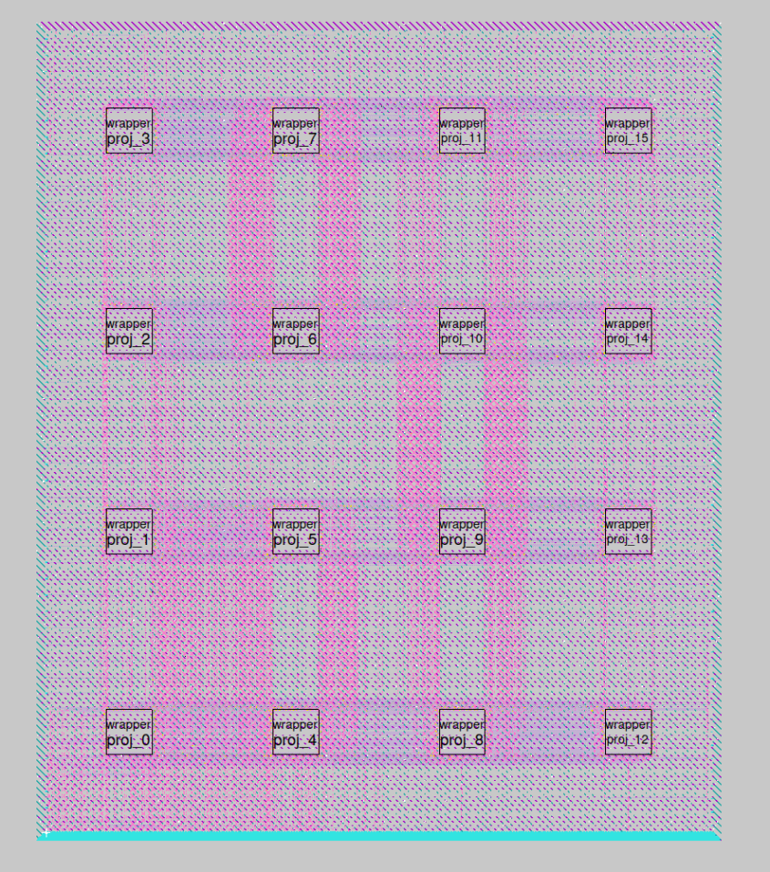

# Multi project tools

A tool to help automate verification of sub projects and collect and harden them into the final submission.

* Project outputs isolated with tristate buffers
* Projects are activated by the Caravel logic analyser

Projects must conform to the [specification](docs/project_spec.md). Here are some example projects:

* [Frequency Counter](https://github.com/mattvenn/wrapped_frequency_counter)
* [Seven Segment Seconds](https://github.com/mattvenn/seven_segment_wrapper)
* [RGB Colour Mixer](https://github.com/mattvenn/wrapped_rgb_mixer/tree/caravel)
* [A51 Encryption](https://github.com/mattvenn/a5-1-wb-macro/tree/multi_proj_tools)

## Dependencies

* OpenLANE & PDK installed (tested with v0.9)
* projects.yaml file with correct paths
* netgen local install: https://github.com/RTimothyEdwards/netgen
* gdspy: https://pypi.org/project/gdspy/

## Config file

[projects.yaml](projects.yaml) contains a list of projects and system wide config.

Some tests now require a recent OpenLANE (tested with v0.9).

## Test everything

     ./multi_tool.py --config projects.yaml  --test-all --force-delete

This command will run all the tests against all projects: 

* check config has correct keys
* runs a module test given Makefile and recipe
* runs the caravel simulation given Makefile and recipe
* runs formal proof on wrapper
* checks wrapper md5sum is correct (if doing an LVS with gds and powered Verilog, then is there any point in doing md5sum on wrapper?)
* checks GDS is correct size, 
* checks GDS nothing on layer metal 5
* run LVS against powered Verilog and GDS - requires v0.9 OpenLANE/PDK
* checks powered Verilog has correct number of tristate buffers
* checks powered Verilog has correct module interface

This functionality is contained within the [Project class](project.py)

To choose a single project, provide the --directory argument.

## Generate OpenLANE config

    ./multi_tool.py --config projects.yaml  --copy-gds --create-openlane-config

This command will get everything ready for a complete system test and hardening of user_project_wrapper:

* copy each project's GDS/LEF to the correct place
* generate OpenLANE configuration for user_project_wrapper (macro placement and obstructions)
* instantiate all the projects inside user_project_wrapper.v, 
* TODO build the include file for Caravel RTL and config

This functionality is contained within the [Collection class](collect.py)

## Done by hand

run OpenLANE to harden user_project_wrapper:

    cd $CARAVEL_ROOT/openlane ; make user_project_wrapper

## TODO

* still haven't got a clean hardened upw. use v0.9
* test with vga_clock - as it uses .hex files. will probably break the include system
* caravel test duplication is ugly
* template repository with everything in the right place and a default yaml
* assert all projects have different IDs
* if cocotb test fails, the return code from make is a pass
* fetch projects from a git ref
* check license
